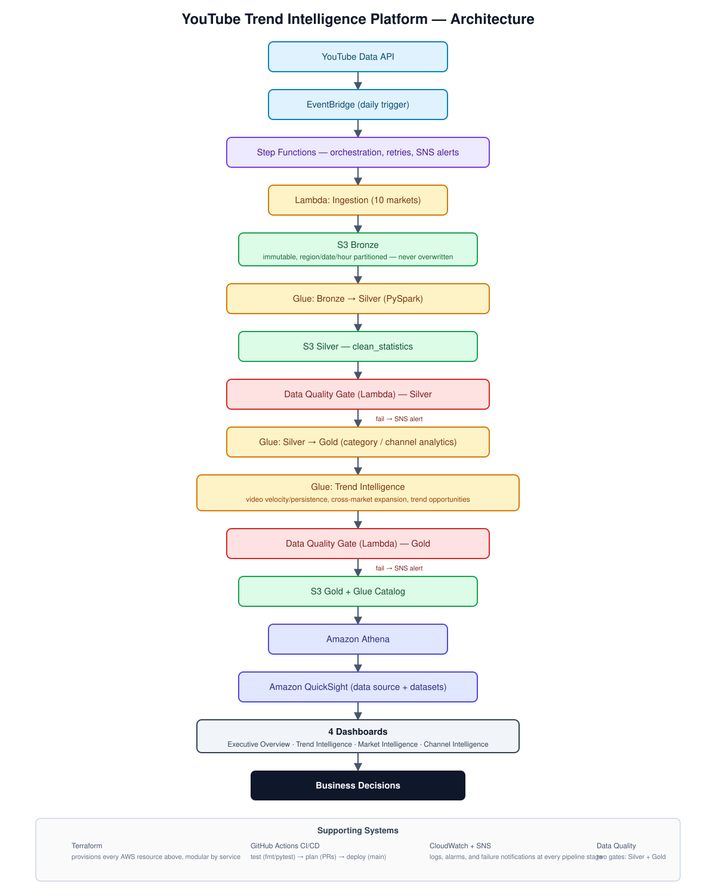

# YouTube Trend Intelligence Platform

A serverless data platform that ingests daily YouTube trending-video snapshots
across 10 markets and turns them into **trend intelligence**: which videos
are gaining velocity, which categories are rising or fading, which trends
are spreading across markets, and which channels are driving it — not just
an aggregated dump of trending data.

Infrastructure is provisioned with Terraform and deployed via GitHub Actions
CI/CD, which now gates every deploy behind a real test suite (previously it
deployed straight from `terraform apply -auto-approve` with no tests at all).

---

## Business Problem

A creator, media company, agency, or brand needs to answer four questions a
raw trending-videos table can't answer on its own:

- **What is trending?** — which videos/categories are gaining momentum, not
  just which have the most views right now.
- **Where is it trending?** — is a category's popularity local to one market,
  or spreading across several?
- **Who is driving it?** — which channels repeatedly appear in trending
  content, and where are they growing fastest?
- **What should we pay attention to?** — of everything trending today, what's
  actually an emerging opportunity vs. background noise?

## Why Trend Intelligence, Not Just ETL?

A single daily snapshot of "what's trending" is a fact. Trend intelligence
requires comparing that snapshot against its own history — the same video's
views yesterday vs. today, the same category's growth over the last week,
whether a category has spread from one market into three more. That's why
this platform is built around **preserved historical snapshots** (nothing in
Bronze is ever overwritten) and a dedicated Trend Intelligence Gold layer
that computes velocity, persistence, and cross-market signals on top of that
history — see `docs/trend_intelligence.md` for the full methodology.

---

## Architecture

<p align="center">
    
</p>

*(The original `Architecture.png`/`.drawio` describe the pre-Trend-Intelligence
pipeline and are kept for history; `Architecture.svg` above reflects the
current architecture and was authored directly as SVG rather than edited
blind in drawio's XML format, since drawio's format can't be validated
without the drawio app itself.)*

```text
YouTube Data API
       │
       ▼
  EventBridge (daily)
       │
       ▼
  Step Functions ── orchestrates the entire pipeline below, with
       │             retries, Catch blocks, and SNS failure alerts
       │             at every stage
       ▼
  Lambda: Ingestion ──► S3 Bronze (immutable, region/date partitioned)
       │
       ▼
  Glue Crawler + Glue/PySpark: Bronze → Silver
       │
       ▼
  Data Quality Gate (Lambda, Silver) ──fail──► SNS Alert
       │ pass
       ▼
  Glue/PySpark: Silver → Gold (category/channel analytics)
       │
       ▼
  Glue/PySpark: Trend Intelligence (video velocity/persistence,
       │         cross-market expansion, trend opportunities)
       ▼
  Data Quality Gate (Lambda, Gold) ──fail──► SNS Alert
       │ pass
       ▼
  Athena (Gold tables) ──► QuickSight (data source + datasets)
       │                        │
       ▼                        ▼
  sql/*.sql               4 dashboards (spec in docs/dashboard.md)
       │                        │
       └───────────┬────────────┘
                    ▼
           Business Decisions
```

`docs/architecture.md` has the full component-by-component breakdown;
`docs/decisions.md` records the specific tradeoffs made while building this
(why AU stayed instead of MX, why 7 candidate Gold tables became 4, etc.).

---

## Data Flow

### Bronze — immutable raw snapshots

`bronze/youtube/raw_statistics/region={region}/date={date}/hour={hour}/{ingestion_id}.json`
— one file per ingestion run per region, never overwritten. This is what
makes every downstream velocity/growth/persistence calculation possible: you
can't measure a trend without a preserved history to compare against.
Expires after 90 days (Silver/Gold have already derived what they need by
then).

### Silver — `clean_statistics`

Schema-validated, deduplicated, one row per `(video_id, region,
trending_date)`. Adds derived metrics: engagement rates (both legacy
percentage-based and spec-defined fraction-based), parsed video duration,
video age, and views-per-hour. Full column reference in `docs/data_model.md`.

### Gold — analytics + trend intelligence

| Table | Grain | What it answers |
|---|---|---|
| `trending_analytics` | region × date | daily rollup per market |
| `category_analytics` | category × region × date | category performance, growth, momentum, rank |
| `channel_analytics` | channel × region × date (cumulative-to-date) | channel trajectory over time, not just a lifetime total |
| `video_trends` | video × region × date | view growth rate, rank change, persistence, trend stage |
| `trend_opportunities` | opportunity × scope × region × date | the ranked, explainable "pay attention to this" table |

### Data Quality

Two gates, not one: Silver (row count, schema, null%, value ranges,
freshness, uniqueness) and Gold (uniqueness of the video/opportunity grain,
plus bounds-checking every 0–100 trend score). A failure at either gate stops
the pipeline before bad data reaches a dashboard — see
`terraform/lambda/scripts/data_quality_check/lambda_function.py`.

---

## Trend Intelligence Methodology

Full formulas, thresholds, and worked examples in **`docs/trend_intelligence.md`**.
Summary:

- **Velocity**: `(views - previous_views) / previous_views`, compared only
  against the same video's own previous snapshot in the same region. Null
  (never a fabricated 0% or ∞%) when there's no previous snapshot or the
  previous value was zero.
- **Persistence**: a running count of trending days per video, capped at 7
  days for scoring purposes.
- **Trend stage**: a documented, rule-based classifier (EMERGING / SUSTAINING
  / ESTABLISHED / FADING) — every threshold is a named constant, not a
  black-box model.
- **Cross-market expansion**: how many markets a category is trending in, and
  whether that count is growing — the "is this spreading from India into
  other markets" signal.
- **Trend score**: a weighted, percentile-rank-based composite (velocity +
  engagement + persistence, plus market expansion for categories), with every
  component stored alongside the score so "why did this rank #1" is always
  answerable from the row itself.

---

## Dashboard

Four dashboards, each answering one business question — full spec (which
dataset, which fields, which chart type) in **`docs/dashboard.md`**:

1. **Executive Trend Overview** — what's trending right now
2. **Trend Intelligence** — which trends are gaining momentum
3. **Market Intelligence** — where it's happening, and whether it's spreading
4. **Channel & Content Intelligence** — who's driving it

The Athena query layer (`sql/*.sql`) and the QuickSight data source +
datasets (`terraform/quicksight/`) are fully Terraform-managed. The visual
dashboard layout itself is documented as a build-in-console spec rather than
hand-authored Terraform JSON — see `docs/dashboard.md` for why.

---

## AWS Services

| Service | Purpose |
|---|---|
| Lambda | ingestion, reference-data flattening, data quality checks |
| Step Functions | orchestrates the full pipeline with retries and failure alerts |
| S3 | Bronze/Silver/Gold storage, Athena query results |
| Glue (PySpark) | Bronze→Silver, Silver→Gold, Trend Intelligence transforms |
| Glue Data Catalog | schema registry for every Bronze/Silver/Gold table |
| Athena | SQL query engine over Gold |
| QuickSight | dashboard data source + datasets |
| EventBridge | daily trigger |
| CloudWatch | logs, dashboard, alarms |
| SNS | failure notifications |

Every service here earns its place against a specific pipeline stage —
nothing was added to pad the architecture diagram.

---

## Infrastructure

Terraform, modular by AWS service (`terraform/{bootstrap,s3,iam,sns,glue,
lambda,step_functions,eventbridge,monitoring,budget,quicksight}`), each its
own state — see **Deployment** below for the init order.

---

## CI/CD

GitHub Actions (`.github/workflows/terraform.yml`):

- **`test`** (every push and PR): installs the Python test dependencies,
  runs the full Lambda + Glue/PySpark suite, and enforces **95% minimum
  line coverage**. Deploys are blocked if this fails.
- **`deploy`** (push to `main`, after `test` passes): applies every module in
  dependency order.

---

## Testing

Business logic (growth rates, velocity, persistence, trend scoring, category
momentum, channel ranking, cross-market analysis, data quality checks) is
kept as pure functions, separated from AWS I/O, and covered by
`tests/lambda/` and `tests/glue/`. The CI gate requires **at least 95% line
coverage** across the Lambda and Glue transformation code.

Run the full suite locally:

```bash
make test
```

Glue tests require Java and PySpark. The test suite mocks AWS I/O so it does
not require an AWS account or real S3/Athena/SNS calls.

---

## Data Model

Full grain/column/formula reference: **`docs/data_model.md`**.

---

## Deployment

This repo has **no root Terraform configuration** — each folder under
`terraform/` is its own state (see `backend.tf` in each module), so
`terraform init` won't do anything useful from the repo root. Run
init/plan/apply **inside each module directory**, in this order, since later
modules read earlier ones via `terraform_remote_state`:

1. `terraform/bootstrap` — one-time only, creates the state bucket + lock table
2. `terraform/s3`, `terraform/iam`, `terraform/sns` — no cross-dependencies, any order
3. `terraform/glue`, `terraform/lambda`, `terraform/step_functions` — depend on `iam`
4. `terraform/eventbridge` — depends on `iam` and `step_functions`
5. `terraform/monitoring` — depends on resources created in previous modules
6. `terraform/quicksight` — depends on Athena/Glue having Gold tables to point at; also needs the one-time manual QuickSight subscription + permissions step in `docs/dashboard.md`
7. `terraform/budget` — standalone, deployed last

```bash
cd terraform/<module>
terraform init
terraform plan     # terraform/lambda additionally needs -var="youtube_api_key=<key>"
terraform apply    # terraform/lambda additionally needs -var="youtube_api_key=<key>"
```

Pushing to `main` triggers GitHub Actions, which runs the full test suite and
then deploys all modules sequentially in dependency order.

### Destroy everything

```bash
make destroy       # all modules, reverse dependency order
make destroy-all    # destroy + instructions for state cleanup
```

---

## Cost Considerations

- Glue jobs run on `G.1X` workers at minimal worker counts (2), sized for
  ~500 trending videos/day across 10 markets — not production-scale traffic.
- Athena/S3 costs scale with data scanned per query; Gold tables are
  Parquet + partitioned to keep scans small.
- QuickSight has its own per-user/session pricing, separate from the rest of
  this stack — see AWS's QuickSight pricing page before enabling it broadly.
- `aws_glue_job` recomputes Gold from full Silver/Gold history on every run
  (no incremental bookmarks in `silver_to_gold_analytics`/
  `trend_intelligence`) — fine at current data volume, but job duration (and
  cost) will grow with accumulated history. Documented as a known tradeoff,
  not silently ignored.

---

## Limitations

- `categories_present` (distinct categories a channel has trended in) is not
  yet implemented on `channel_analytics` — see `docs/trend_intelligence.md` §7.
- Trend-stage/scoring thresholds are reasonable starting points, not tuned
  against real outcomes yet — there isn't enough accumulated history to tune
  them meaningfully.
- The QuickSight dashboard *data layer* (source + datasets) is Terraform-
  managed; the visual dashboard layout is a documented spec, not Terraform —
  see `docs/dashboard.md`.
- The deployed 10th market is Australia (`au`), not Mexico — see
  `docs/decisions.md` for why.

## Future Improvements

- Topic extraction / NLP on video titles and descriptions
- Semantic clustering of related trending content
- Anomaly detection on unusual velocity spikes
- Forecasting (predicting tomorrow's trend score, not just describing today's)
- Sentiment analysis on trending content
- Creator recommendations ("channels like yours are also trending in...")
- Real-time ingestion (currently daily-batch by design, since trend
  comparison needs day-over-day snapshots, not sub-hourly noise)
- Apache Iceberg / table-format upgrade for Gold, if incremental Gold
  recomputation becomes worth the added complexity

None of the above is implemented — listed here as genuine next steps, not
padding.

---

## Skills Demonstrated

Data Engineering · Trend/BI Analytics Engineering · Serverless Architecture ·
Infrastructure as Code · Medallion Architecture (Bronze/Silver/Gold) ·
PySpark window functions · AWS Glue · AWS Lambda · AWS Step Functions ·
Amazon Athena · Amazon QuickSight · Terraform · GitHub Actions CI/CD · Data
Quality Engineering · Explainable scoring/classification design

---

## License

This project is licensed under the MIT License.


## Testing and CI

See [docs/testing.md](docs/testing.md) for the Python/PySpark coverage gate, Terraform validation, SQL contract tests, and CI/CD quality-gate order.
